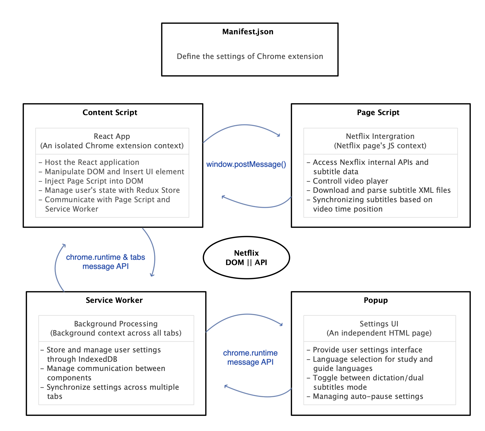

# LingoScribe - Chrome Extension

**📌Transform Netflix into a Language Learning Platform**

## Introduction

LingoScribe is a Chrome extension that enhances the Netflix viewing experience by providing real-time subtitle dictation and dual subtitles features for language learning.
This extension utilizes multiple execution contexts to comply with Chrome's security policies.

## Key Features

- **Netflix integration**: Extracts subtitles using Netflix's internal APIs.
- **Real-time dictation**: Type what user hear while watching videos and and check answers.
- **Dual subtitles**: Display subtitles in both user's learning language and native language.
- **Auto-pause**: The video automatically pauses during dictation for better learning focus.
- **User settings management**: Save and sync learning preferences using IndexedDB.

## Architecture Overview

### Key Components

### ❓Why Context Separation is Necessary

Due to Chrome extension security policies and API usage restrictions, the structure is separated to allow each component to perform its role. Each contexts has different access permissions, requiring message exchange between them.  
[Approach and Decisions PDF](https://github.com/jeannjang/lingo-scribe/blob/main/doc/architecture-decisions.md)

#### 1. Security Model (Isolated Worlds)

Chrome's security model is based on the "Isolated Worlds" principle. This principle establishes clear boundaries between extensions and web pages by preventing extensions from unexpectedly affecting the web page's JavaScript execution.

#### 2. Functional Limitations

- **Content Script**: Can access the DOM but cannot directly access the web page's JavaScript environment
- **Page Script**: Can access the web page's JavaScript environment but cannot use chrome extension APIs
- **Service Worker**: Can use all extension APIs but cannot directly access the DOM

#### 3. Lifecycle Management

- **Content Script**: Created when a specific web page loads, destroyed when leaving the page
- **Page Script**: Injected by the Content Script and follows the web page's lifecycle
- **Service Worker**: Can run continuously while the extension is installed (enters dormant state when inactive)
- **Popup**: Activated only when the user clicks the extension icon, destroyed when focus is lost

#### 4. Communication Mechanisms Between Components

- **Content Script ↔ Page Script**:

    - Use `window.postMessage()`
    - Exchange subtitle requests/responses and video control commands

- **Content Script ↔ Service Worker**:

    - Use `chrome.runtime.sendMessage()`
    - Request and updates user settings

- **Popup ↔ Service Worker**:

    - Use `chrome.runtime.sendMessage()`
    - Send setting changes and notifications

- **Service Worker → All Tabs**:
    - Use `chrome.tabs.query()` and `chrome.tabs.sendMessage()`
    - Broadcast setting changes to all Netflix tabs

## Technology Stack

- **Frontend**:
  React 19, Tailwind CSS, ShadCN UI, Custom Hooks, DOM Manipulation

- **State Management**: Redux, Redux Saga, IndexedDB, Messaging API

- **Build Tools and Dev Environment**: Webpack, Yarn, ESLint, PostCSS, HtmlWebpackPlugin

- **TypeScript Based**: Enhanced type safety and development efficiency

## License

This extension is officially published on the Chrome Web Store. While it is currently used for portfolio purposes, it is part of an ongoing personal business project.
Unauthorized reproduction, distribution, or usage without explicit permission is strictly prohibited.
